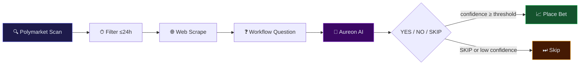

<div align="center">

# AXRLEN

### Autonomous Polymarket intelligence · Aureon-trained · Railway-ready

**Scan markets → scrape reality → ask one question → place the bet.**

<br />

[](https://www.python.org/)
[](https://docs.polymarket.com/)
[](https://openai.com/)
[](https://railway.app/)
[](LICENSE)

[](https://github.com/shep95/axrlen_automated_sports_betting)
[](.env.example)
[](brains/)

<br />

[Quick Start](#-quick-start) ·
[Workflow](#-workflow-logic) ·
[Brains](#-aureon-brain-corpus) ·
[Deploy](#-railway-deploy) ·
[Config](#-configuration) ·
[Architecture](#-architecture)

</div>

---

## Overview

**Axrlen** is an automated Polymarket betting agent that operates on short-horizon markets — weather, crypto, and niche events resolving within **24 hours**. Every cycle runs in **5–10 minutes**, pulls live external data, consults your full **Aureon brain corpus**, and executes through a single disciplined rule:

> **Simple question → simple answer → bet.**

| | |
|---|---|
| **Platform** | [Polymarket](https://polymarket.com) via Gamma + CLOB V2 |
| **Intelligence** | OpenAI + 67 Aureon brain files |
| **Hosting** | [Railway](https://railway.app) · Docker · `/health` endpoint |
| **Safety** | Paper trading on by default |

---

## Workflow logic



### The workflow question

Every market is reduced to one prompt:

```text
Do you think [subject] that [event] will happen [timeframe]?
```

| Slot | Source | Example |
|------|--------|---------|
| **subject** | Keywords from the bet | `nyc / temperature / 85f` |
| **event** | Core claim from market title | `NYC high temperature exceed 85°F on June 4` |
| **timeframe** | Hours to resolution | `today` · `tomorrow` · `within N days` |

**AI output:** `YES` · `NO` · `SKIP` — no essays, no hedging, no markdown.

<details>
<summary><strong>Example end-to-end</strong></summary>

<br />

**Market:** *Will NYC high temperature exceed 85°F on June 4?*

**Workflow question:**
> Do you think **nyc / high / temperature / 85f** that **NYC high temperature exceed 85°F on June 4** will happen **tomorrow**?

**Scraped context:** Open-Meteo forecast · market implied odds

**AI verdict:** `YES` @ 78% confidence → paper/live bet placed

</details>

---

## Aureon brain corpus

The betting AI is trained on your **full Aureon agent brains** — not a generic system prompt.

```
brains/
├── aureon/                  # 33 txt/md brains from Aureon Files
├── aureon/extracted/        # 32 PDF extracts (sports, trading, vedic, prompts)
├── BRAIN_MANIFEST.md        # Priority manifest
└── axrlen_default_brain.txt # Betting-specific rules
```

**Load priority**

| Tier | Brains |
|------|--------|
| 1 | Hard constraints · Anti-spiral protocol |
| 2 | Ava Sports · Zophiel Trading · Nestal fractals |
| 3 | Vedic prediction · analytics · Occultism algorithm |
| 4 | Zophiel prompt engine · architecture |
| 5 | Philosophy · psychology · coding training |

Re-import after updating local Aureon Files:

```bash
python scripts/import_aureon_brains.py
python scripts/import_aureon_brains.py "/path/to/Aureon Files"
```

Tune context window: `BRAINS_MAX_CHARS=250000`

---

## Quick start

### Local

```bash
git clone https://github.com/shep95/axrlen_automated_sports_betting.git
cd axrlen_automated_sports_betting

python -m venv .venv
source .venv/bin/activate          # macOS / Linux
# .venv\Scripts\activate           # Windows

pip install -r requirements.txt
cp .env.example .env               # add OPENAI_API_KEY
python main.py
```

### Verify

```bash
pytest tests/ -q
curl http://localhost:8080/health
```

> **Paper trading is the default.** No real funds move until you explicitly enable live mode.

---

## Railway deploy

<div align="center">

[](https://railway.app/new/template)

</div>

| Step | Action |
|------|--------|
| 1 | Connect this repo to a new Railway project |
| 2 | Set `OPENAI_API_KEY` in Railway variables |
| 3 | Optional: `TAVILY_API_KEY` for richer web search |
| 4 | Deploy — health check hits `/health` automatically |
| 5 | Keep `PAPER_TRADING=true` until you've validated cycles |

Railway reads `railway.toml` + `Dockerfile`. The Aureon brains ship with the repo — no external brain mount required.

---

## Configuration

<details open>
<summary><strong>Core</strong></summary>

| Variable | Default | Description |
|----------|---------|-------------|
| `OPENAI_API_KEY` | — | **Required** |
| `OPENAI_MODEL` | `gpt-5.2` | Decision model |
| `PAPER_TRADING` | `true` | Simulate bets |
| `LIVE_TRADING` | `false` | Real CLOB orders |
| `AXRLEN_CONFIRM_LIVE_RISK` | `false` | Must be `true` for live |

</details>

<details>
<summary><strong>Trading</strong></summary>

| Variable | Default | Description |
|----------|---------|-------------|
| `POLYMARKET_PRIVATE_KEY` | — | Wallet key (live) |
| `POLYMARKET_FUNDER_ADDRESS` | — | Polymarket deposit address |
| `BET_SIZE_USD` | `5` | Size per bet |
| `MIN_CONFIDENCE` | `0.65` | Min AI confidence to act |
| `MARKET_CATEGORIES` | `weather,crypto` | Scan targets |

</details>

<details>
<summary><strong>Timing & brains</strong></summary>

| Variable | Default | Description |
|----------|---------|-------------|
| `SCAN_INTERVAL_MINUTES` | `7` | Cycle interval (5–10 recommended) |
| `RESOLUTION_WINDOW_HOURS` | `24` | Only markets ending within window |
| `MAX_MARKETS_PER_CYCLE` | `3` | Markets evaluated per run |
| `BRAINS_DIR` | `./brains` | Brain corpus path |
| `BRAINS_MAX_CHARS` | `250000` | AI context budget |
| `TAVILY_API_KEY` | — | Optional web search |

</details>

### Go live checklist

- [ ] Fund Polymarket wallet on Polygon
- [ ] Set `POLYMARKET_PRIVATE_KEY` + `POLYMARKET_FUNDER_ADDRESS`
- [ ] Set `LIVE_TRADING=true` · `PAPER_TRADING=false` · `AXRLEN_CONFIRM_LIVE_RISK=true`
- [ ] Review [Polymarket CLOB V2 docs](https://docs.polymarket.com/trading/overview)

---

## Architecture

```
axrlen_automated_sports_betting/
│
├── axrlen/
│   ├── polymarket/     Gamma API discovery + CLOB V2 execution
│   ├── scanner/        24h resolution filter + market scoring
│   ├── scraper/        Open-Meteo · CoinGecko · Tavily
│   ├── ai/             Brains loader · prompt engine · decision gateway
│   └── workflow/       End-to-end pipeline
│
├── brains/             Aureon corpus (67 files)
├── scripts/            import_aureon_brains.py
├── main.py             Scheduler + health server
├── Dockerfile
└── railway.toml
```

### Data sources

| Category | Provider | Data |
|----------|----------|------|
| Weather | [Open-Meteo](https://open-meteo.com/) | Forecast · temp · precipitation |
| Crypto | [CoinGecko](https://www.coingecko.com/) | Spot price · 24h change |
| General | [Tavily](https://tavily.com/) | Live web search (optional) |
| Markets | [Polymarket Gamma](https://docs.polymarket.com/) | Events · prices · resolution |

---

## Development

```bash
pytest tests/ -q                    # run test suite
python scripts/import_aureon_brains.py   # refresh brains from Aureon Files
```

---

<div align="center">

### Disclaimer

This software is for **educational purposes**. Prediction market trading carries financial risk.  
You are responsible for compliance with local laws and platform terms of service.

<br />

**Axrlen** · Aureon-trained · Built for short-horizon Polymarket intelligence

[↑ Back to top](#axrlen)

</div>
